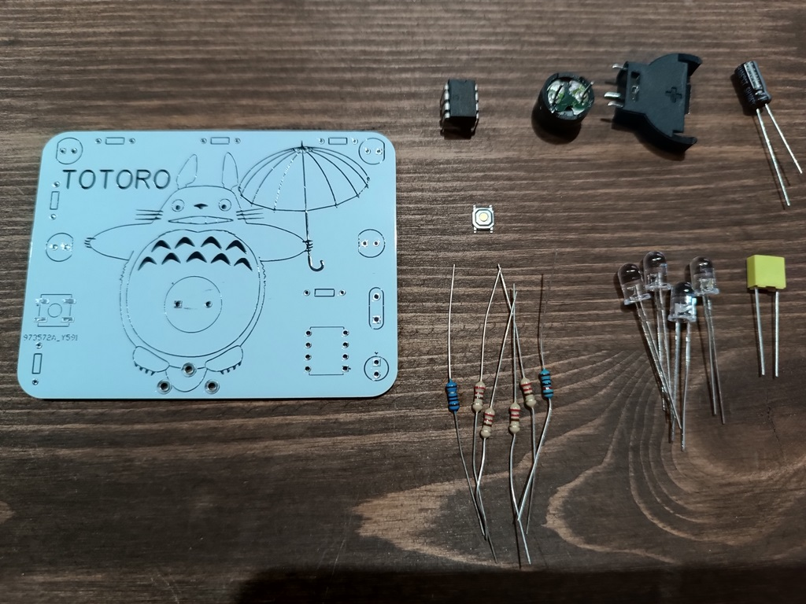
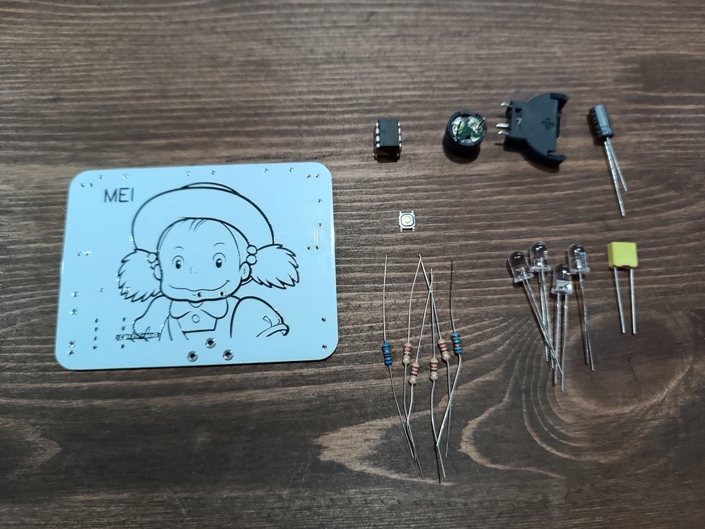
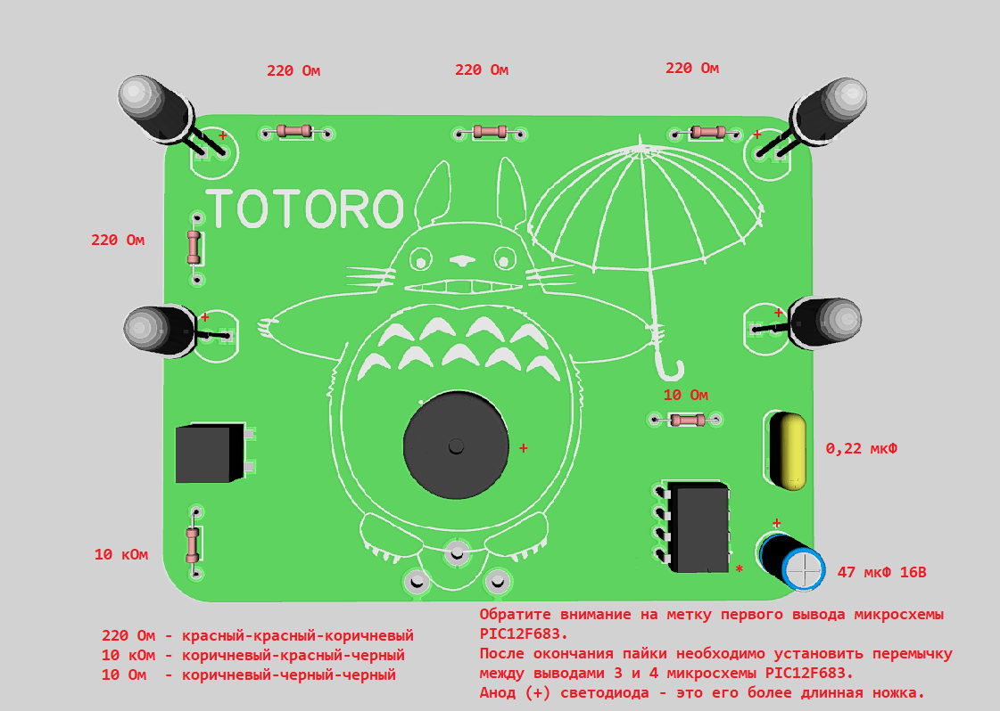

# DIY Kit for soldering training "Totoro"

The simple soldering training kit. 

PCB made with DipTrace software. The source code wrote in MikroC for PIC.

https://www.youtube.com/watch?v=O17n7GcvxP4

------

